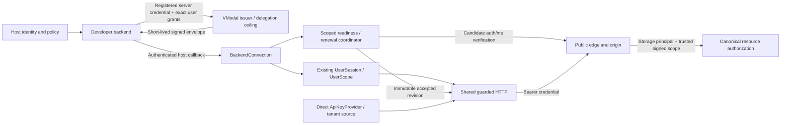
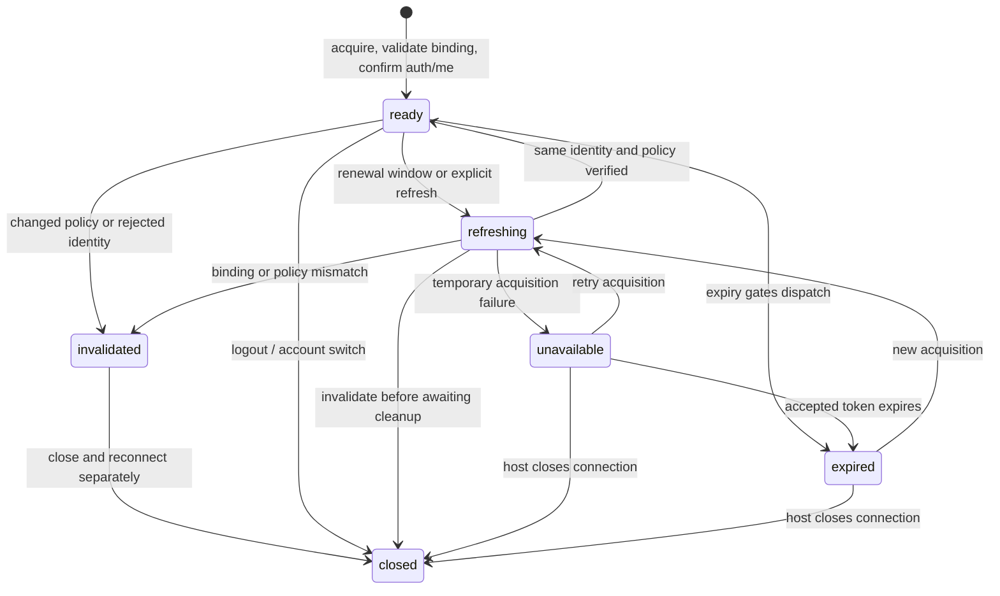
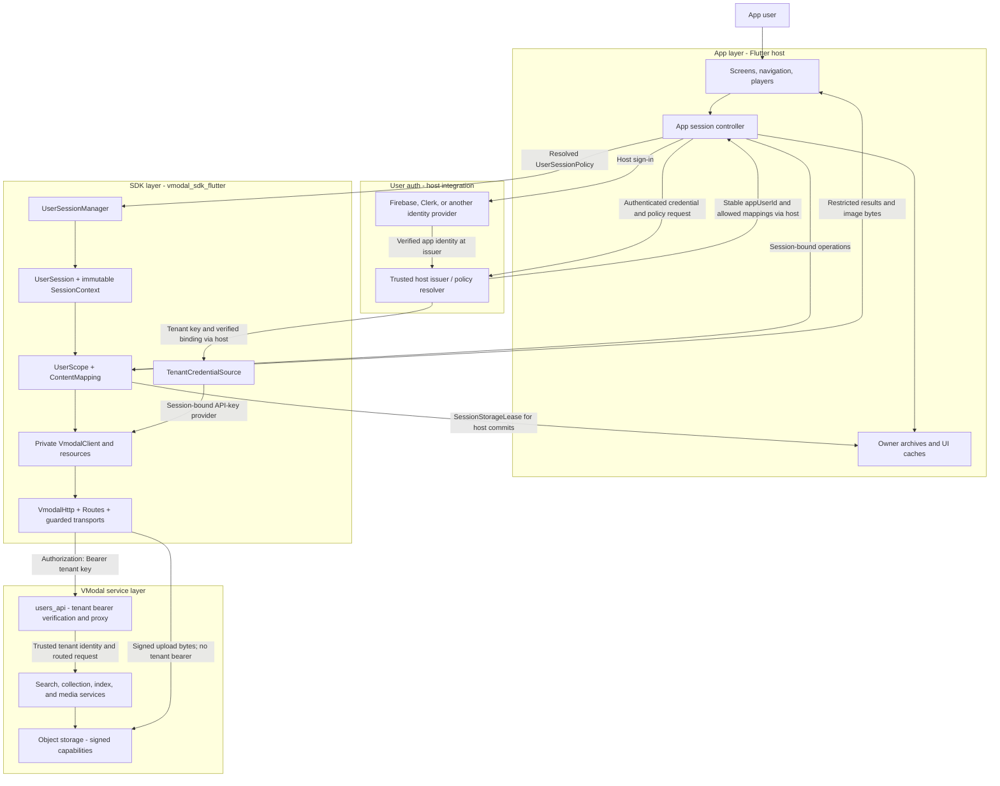
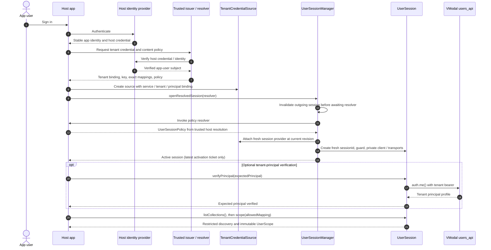
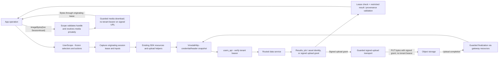
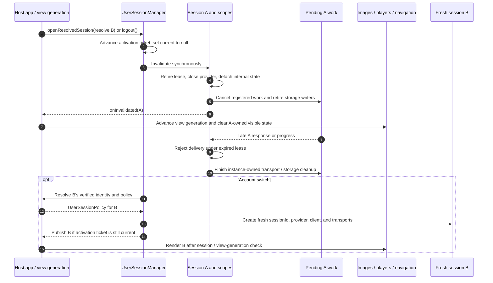
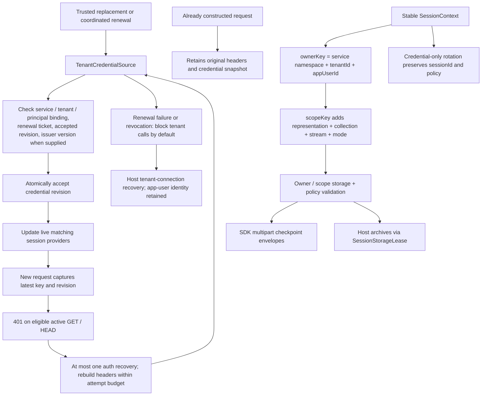

# Flutter component couplings

These diagrams describe the gateway-mode SDK and its opt-in app-user session
API in the 1.3.0 source interface. The host app owns sign-in, trusted identity
and policy resolution, and visible UI state. The SDK owns session guards,
resource operations, transport, and tenant credential coordination.

## Dual authentication and the server authority boundary

The numbered tenant-session sequences below remain the direct-key pattern.
Backend-scoped mode adds a separate credential source while reusing guarded
session operations. Both use the same public gateway. See
[authentication.md](authentication.md) and
[backend_authentication.md](backend_authentication.md).

The storage principal determines home selection, billing and aggregate quota.
App subject/project determine delegated ownership and a stable rate bucket.
Grant labels select exact collection/stream/mode and never manufacture authority.
Upstream handlers enforce complete grants even for raw HTTP clients.

State is observable behavior, not a host login state machine. A still-valid old
revision can serve independent requests during transient renewal failure;
expired/rejected revisions cannot dispatch. Closing fences late renewal and
search/progress/storage completions. Same-policy rotation preserves owner keys;
new project/user/policy requires a fresh session. Already issued remote jobs or
signed capabilities retain their independently documented lifetime.

## 1. App, user auth, VModal auth, and SDK layers

The identity provider and issuer are host integrations. The
[Framebase userlogin example](../example/05_framebase_userlogin/README.md) has
mock adapters; a production issuer must verify the host identity and resolve
its authorized content policy. It is not an SDK login endpoint.

| Identity / selector | Supplied by | Meaning |
| --- | --- | --- |
| `appUserId` | Authenticated host | Stable app user; A and B remain different even with one tenant key |
| `tenantId`, expected principal, API key | Trusted tenant issuer | VModal connection binding; `auth.me()` checks the tenant principal |
| `sessionId` | SDK on every activation | Runtime lease for requests, callbacks, and live resource handles |
| `ContentMapping` | Trusted host policy | Exact collection, stream, mode, actions, and collection-wide permission |
| `ownerKey`, `scopeKey`, `policyRevision` | SDK context / trusted policy | Stable storage partition and policy validation |

App-user identity is separate from `SdkConfig.userId`, gateway identity
headers, and collection names. The gateway derives its identity from the
tenant bearer. Under a shared key, local SDK policy does not establish
server-side app-user authorization.

## 2. Sign-in and session activation

For account changes, begin `openResolvedSession` before asynchronous identity
or mapping resolution. The diagram's first credential acquisition assumes an
initial activation. `openUserSession` is available when the host already has
the verified policy. `auth.me()` verifies neither the app-user ID nor its
allowed mapping.

## 3. Data requests, signed uploads, and media

Session checks cover preparation, sends, retries, signed phases, response
chunks, completion, and progress callbacks. `SessionAsset` and `SessionJob`
handles belong to the originating live session and scope. Signed URLs remain
private in the restricted interface and have independent expiry. A server
operation already accepted can continue after local cancellation.

The compatible `VModalProject` / `VModalScope` and direct `VmodalClient` APIs
delegate to the same resources but bypass app-user session guarantees. Their
host must manage account cancellation, storage partitioning, and UI cleanup.

## 4. Account switch and logout

A → B → A creates three runtime sessions. Returning to A may reuse validated
owner storage, but cannot reactivate old scopes or handles. Cleanup remains
bound to the outgoing instance even if a callback opens a newer session.
Logout invalidates SDK user data; the host also owns identity-provider sign-out
and cleanup of data already displayed or copied.

## 5. Tenant-key rotation and stable storage ownership

Keys and credential revisions are excluded from stable owner/scope keys.
Host cache entries additionally include policy and result-affecting parameters;
in-flight deduplication includes `sessionId`. Writer retirement and serialized
commits fence older activations within one isolate.

Tenant, endpoint, principal, or content-policy changes require fresh sessions;
changed connection bindings also require a correctly bound credential source.
Mutations are never automatically replayed through auth recovery, and `403` is
not a general refresh trigger. Key rotation does not revoke previously issued
signed capabilities.

## Implementation and contract references

- [Session contracts, provenance, and storage](sdk_contract.md)
- [Tenant credential coordination and recovery](manage_api_key.md)
- [Framebase host integration and issuer envelope](../example/05_framebase_userlogin/README.md)
- [Session manager, context, policy, and scopes](../lib/src/user_session.dart)
- [Tenant credential source and providers](../lib/src/api_key_provider.dart)
- [Session and storage guards](../lib/src/session_guard.dart)
- [Client composition](../lib/src/client.dart) and [shared HTTP](../lib/src/http.dart)

The host issuer must authorize each app user independently. A modified client
with a shared tenant key can call any resource that key authorizes. Server
enforcement therefore needs verified app-user identity and per-resource policy;
the SDK's local isolation alone does not supply that server contract.
