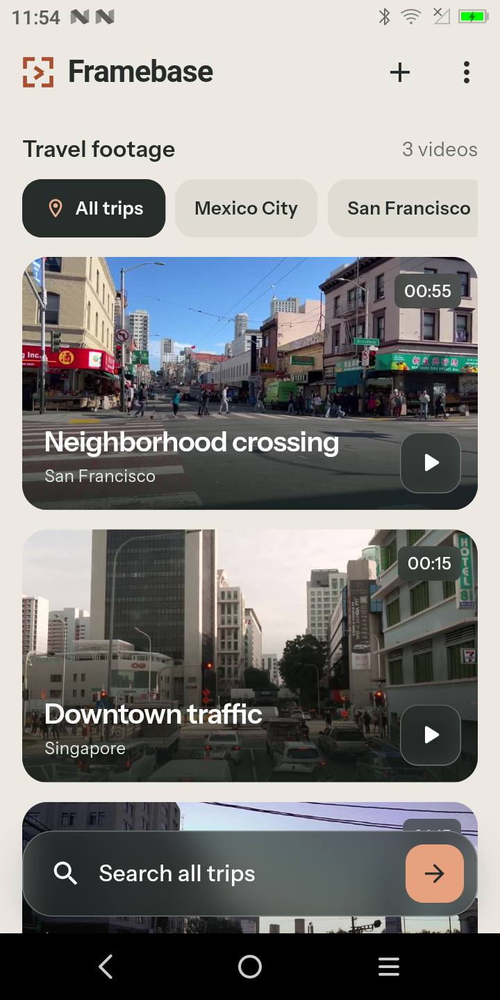

# Framebase

Framebase is a product-style Flutter example for finding moments inside a
small video library with natural-language visual search. It demonstrates the
complete mobile flow: runtime authentication, streamed uploads, asynchronous
indexing, grouped frame results, and playback of the local source video at the
returned timestamp.

The bundled library contains three short city-street recordings. Try searches
such as `A bus on a city street`, `People crossing the street`, or
`Cars at an intersection`.

## Screenshots

| Library | Grouped search results | Source playback |
| --- | --- | --- |
|  |  |  |

## Run the example

From the SDK repository root, install the reviewed Flutter toolchain and fetch
all dependencies:

```bash
bash install.sh install
bash build.sh pub_get
```

Then select an Android or iOS device and run Framebase:

```bash
flutter_bin="$(bash install.sh flutter_bin)"
cd example/05_framebase
"$flutter_bin" run --device-id DEVICE_ID
```

Open **Search settings** from the library menu, enter a valid VModal API key,
and connect. The key is held in memory only. It is not stored, logged, bundled
as an asset, or compiled into the application.

Framebase uses the application-owned collection `framebase_streets` and stream
`street_study` inside the authenticated account. If that collection has no
ready image index, choose **Prepare videos for search**. The app copies its
bundled assets to app-accessible files, uploads them with progress, creates an
image index, polls the job until it is ready, and then enables search.

Uploading and indexing use the authenticated account and may consume service
quota. The app never deletes remote data. Imported MP4 files must be smaller
than 100 MB and are copied into the app's support directory before upload.

## What the code demonstrates

- `MutableApiKeyProvider` and `auth.me()` for runtime authentication.
- `UploadSource.fromFile`, upload progress, and cancellation.
- Image-index creation and status polling.
- Collection-version discovery before search.
- Natural-language video search with an explicit distance cutoff.
- One bulk URL lookup followed by cancellable image retrieval.
- Defensive mapping of filenames, result indexes, and relative timestamps.
- Grouping nearby matches from the same source video.
- Opening a local video at the timestamp returned by search.
- Stale-search cancellation and client cleanup during widget disposal.

The cutoff is an application policy, not a confidence percentage. A broad
nearest-neighbour search can return the closest available street frame even
when the requested subject is absent. Framebase therefore offers a focused
mode that omits weaker matches and an optional looser mode.

Application state such as copied file paths, upload flags, pending index jobs,
and operation history is stored locally. Credentials, search responses,
temporary image URLs, and image bytes are not persisted. Persisted upload state
is tied to the authenticated user identifier and is reset when the user changes.

## Validation

From the SDK repository root:

```bash
bash build.sh format
bash build.sh analyze
bash build.sh test
```

Framebase has offline tests for result mapping, timestamp handling, cancellation,
cutoff enforcement, narrow layouts, grouped results, runtime-key error handling,
and navigation. Live upload, indexing, search, and playback require an API key
and a physical device or emulator.

Android was validated on a physical device. The iOS project is included, but
iOS runtime validation requires macOS and Xcode.

## Footage and license

The bundled clips are edited Pexels stock footage with audio removed. Exact
source links and transformations are recorded in
[`MEDIA_SOURCES.md`](MEDIA_SOURCES.md). The example source is available under
the [MIT License](LICENSE); the bundled footage remains subject to the
[Pexels license](https://www.pexels.com/license/).
