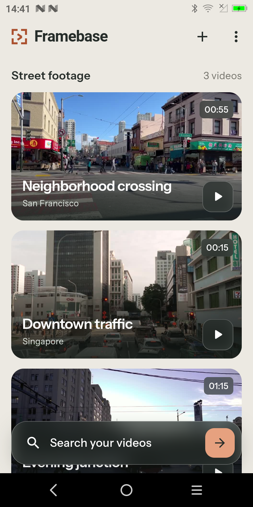
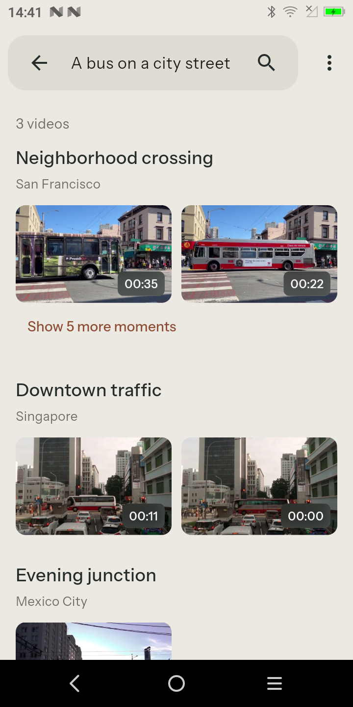
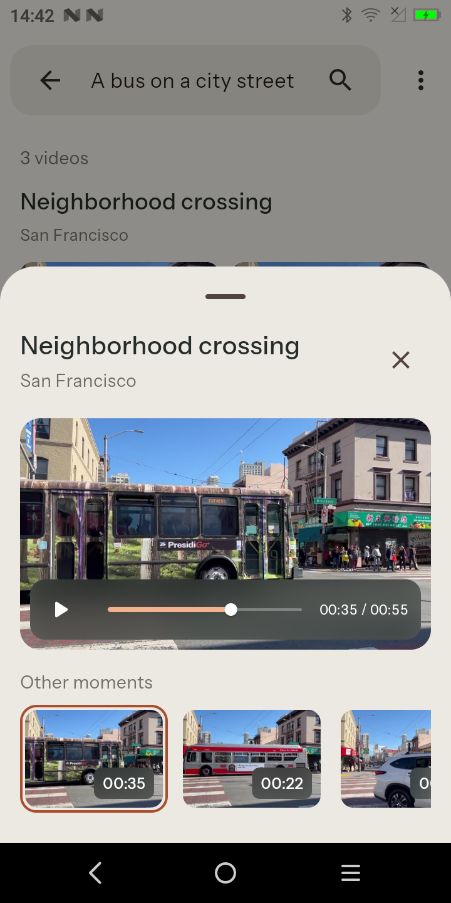
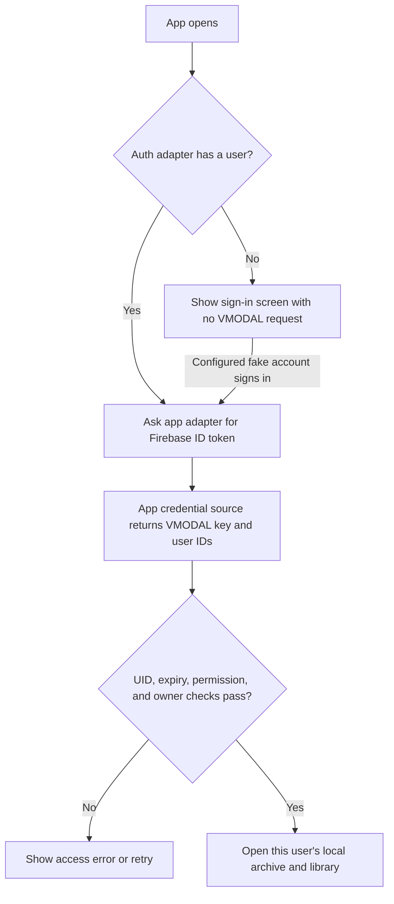
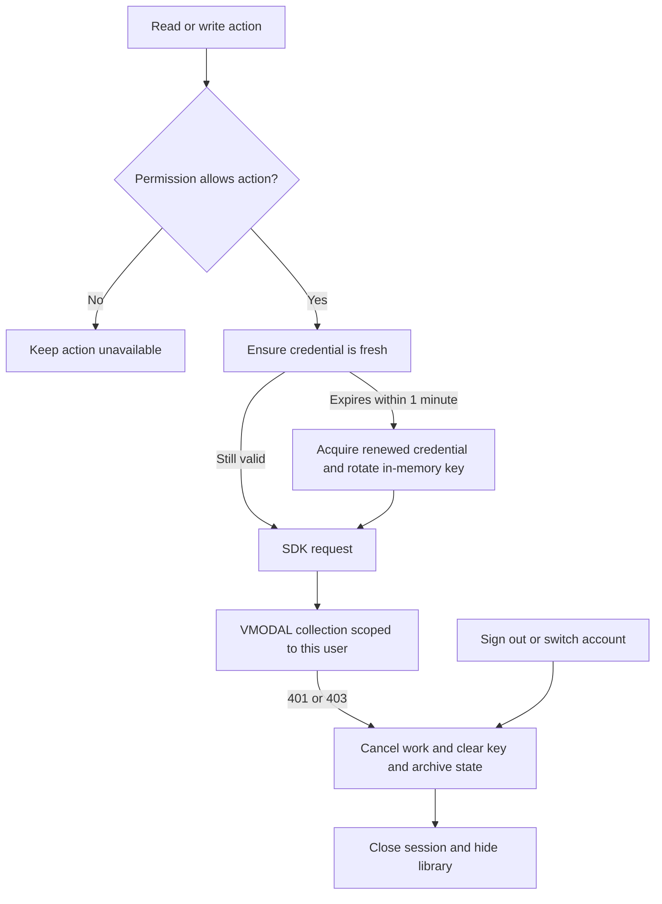

# Framebase user library

This Flutter example gives each signed-in user a separate street-video library.
It shows where app sign-in, a VMODAL credential, SDK requests, local video files,
and search results meet. The video screens come from the original Framebase
example; this version adds a signed-out entry screen and per-user state.

## Screenshots

| Video library | Search results | Playback at a match |
| --- | --- | --- |
|  |  |  |

These are the shared Framebase video screens after access is granted. The
unconfigured offline app opens on **Sign in to your street library** instead.

## Run the offline example

From `uinterface/sdk_flutter`:

```bash
bash install.sh install
cd example/05_framebase_userlogin
flutter_bin="$(bash ../../install.sh flutter_bin)"
"$flutter_bin" pub get
"$flutter_bin" run --device-id DEVICE_ID
```

The default `MockFirebaseAuth` has no accounts, and the credential source has
no usable key. You can inspect the sign-in screen without a backend. To exercise
the signed-in flow, inject a fake account and queued `VmodalCredential` responses
as the tests do. Fixture keys are placeholders, not live credentials. A real
Firebase adapter and trusted credential issuer are still required for production.

## 1. Sign-in and library setup



`UserSessionController` validates the credential's Firebase UID, expiry,
`library:read` permission, and stable user IDs. `SearchGateway.connect()` calls
`auth.me()` to confirm that the VMODAL key belongs to the expected VMODAL user.
Only then does the app show the library. Firebase Auth does not issue the VMODAL
key: an app-owned credential source must supply it.

## 2. API access and account changes



Collection operations target `framebase_streets__user_<collection_user_id>`;
upload, indexing, and search use stream `street_study`. Reads need
`library:read`; uploads and index preparation need
`library:write`. The archive controller checks permissions, and the gateway
fixes the collection scope for SDK calls. A rejected or
expired credential closes access; sign-out also stops work and clears the
in-memory key. The next account gets its own archive under
`accounts/<collection_user_id>/` in application support.

## 3. Video upload, search, and playback


Choose **Prepare videos for search** to upload clips that are not yet uploaded
and create the visual index. Search becomes available once the index has a ready
version. Results use bulk image URL lookup and image download; tapping a result
opens the local source video at its returned timestamp. Imported MP4s and the
`archive.json` manifest stay in the active account's local directory. Credentials,
search responses, signed URLs, and downloaded images are never persisted. The
app does not delete remote videos.

## Code map

| File | Responsibility |
| --- | --- |
| [`lib/user/auth_adapter.dart`](lib/user/auth_adapter.dart), [`lib/user/mock_firebase_auth.dart`](lib/user/mock_firebase_auth.dart) | App-owned auth interface and offline fake |
| [`lib/user/vmodal_credential.dart`](lib/user/vmodal_credential.dart) | Credential envelope, validation, and source interface |
| [`lib/user/user_session_controller.dart`](lib/user/user_session_controller.dart) | Session states, refresh, account switch, and teardown |
| [`lib/data/search_gateway.dart`](lib/data/search_gateway.dart) | Owner check and scoped VMODAL SDK calls |
| [`lib/data/archive_controller.dart`](lib/data/archive_controller.dart) | Per-user local files, upload, indexing, and search |
| [`lib/main.dart`](lib/main.dart) | Signed-out and library screens |

## Verify

From `example/05_framebase_userlogin`:

```bash
flutter_bin="$(bash ../../install.sh flutter_bin)"
"$flutter_bin" pub get
"$(bash ../../install.sh dart_bin)" format --output=none --set-exit-if-changed lib test
"$flutter_bin" analyze
"$flutter_bin" test
```

The offline tests cover auth states, scopes, refresh, account switching,
archive separation, result mapping, and UI gating. Device testing with two
real accounts, a trusted issuer, and a gateway-accepted key remains the
production integration step.

The bundled footage and its license are documented in
[MEDIA_SOURCES.md](MEDIA_SOURCES.md).
