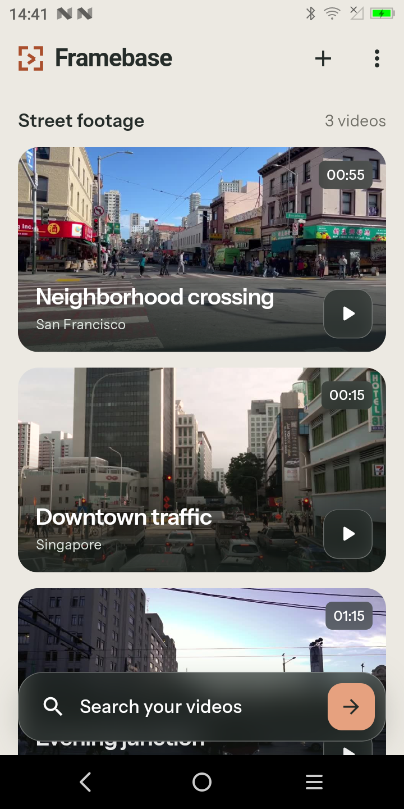
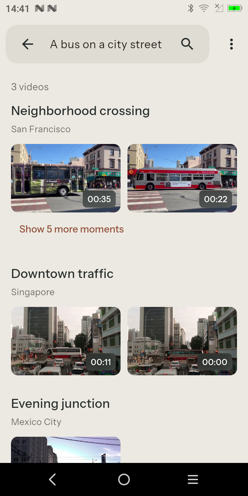
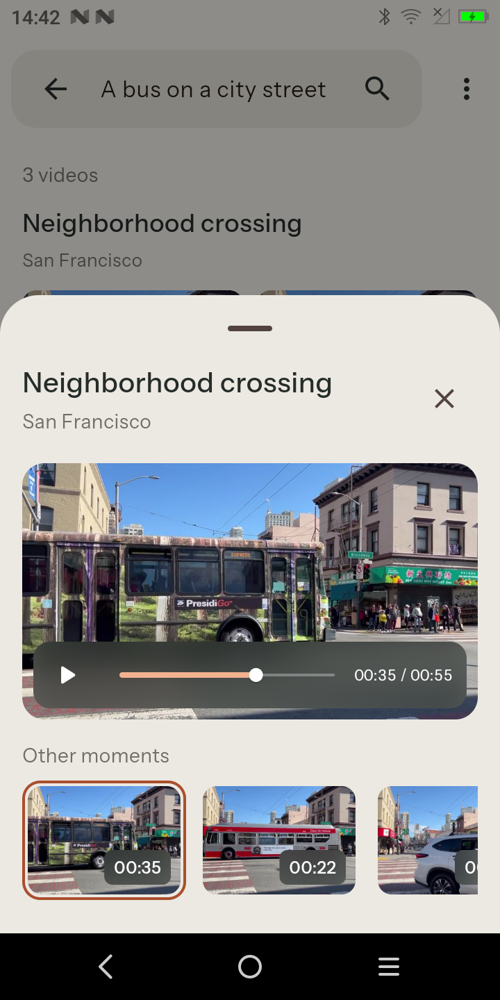
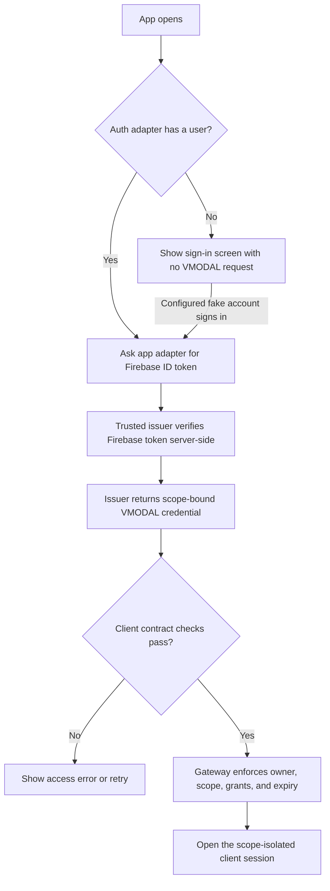
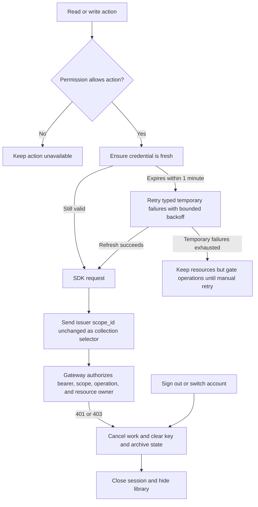

# Framebase user library

This Flutter example opens the one opaque street-video library scope selected by
a trusted credential issuer for the signed-in user. It shows where app sign-in,
a VMODAL credential, SDK requests, local video files, and search results meet.
The video screens come from the original Framebase example; this version adds a
signed-out entry screen and scope-isolated state.

## Screenshots

| Video library | Search results | Playback at a match |
| --- | --- | --- |
|  |  |  |

These are the shared Framebase video screens after access is granted. The
unconfigured offline app opens on **Sign in to your street library** instead.

## Run the offline example

From `uinterface/sdk_flutter`:

```bash
bash install.sh install
cd example/05_framebase_userlogin
flutter_bin="$(bash ../../install.sh flutter_bin)"
"$flutter_bin" pub get
"$flutter_bin" run --device-id DEVICE_ID
```

The default `MockFirebaseAuth` has no accounts, and the credential source has
no usable key. You can inspect the sign-in screen without a backend. To exercise
the signed-in flow, inject a fake account and queued `VmodalCredential` responses
as the tests do. Fixture keys are placeholders, not live credentials. A real
Firebase adapter and trusted credential issuer are still required for production.

## 1. Sign-in and library setup


```mermaid
flowchart TD
    A[App opens] --> B{Auth adapter has a user?}
    B -- No --> C[Show sign-in screen with no VMODAL request]
    B -- Yes --> D[Ask app adapter for Firebase ID token]
    C -->|Configured fake account signs in| D
    D --> E[Trusted issuer verifies Firebase token server-side]
    E --> F[Issuer returns scope-bound VMODAL credential]
    F --> G{Client contract checks pass?}
    G -- No --> H[Show access error or retry]
    G -- Yes --> I[Gateway enforces owner, scope, grants, and expiry]
    I --> J[Open the scope-isolated client session]
```

`UserSessionController` validates the credential's Firebase UID, expiry,
`library:read` permission, stable VMODAL owner, and stable opaque scope.
`SearchGateway.connect()` calls `auth.me()` to confirm that the VMODAL key
resolves to the expected VMODAL user. These fail-closed checks control client UI
and session state; they are not the authorization boundary. Firebase Auth does
not issue the VMODAL key: a trusted app-owned credential issuer must supply it.

## 2. API access and account changes


```mermaid
flowchart TD
    A[Read or write action] --> B{Permission allows action?}
    B -- No --> C[Keep action unavailable]
    B -- Yes --> D[Ensure credential is fresh]
    D -->|Expires within 1 minute| E[Retry typed temporary failures with bounded backoff]
    D -->|Still valid| F[SDK request]
    E -->|Refresh succeeds| F
    E -->|Temporary failures exhausted| L[Keep resources but gate operations until manual retry]
    F --> G[Send issuer scope_id unchanged as collection selector]
    G --> H[Gateway authorizes bearer, scope, operation, and resource owner]
    H -->|401 or 403| I[Cancel work and clear key and archive state]
    J[Sign out or switch account] --> I
    I --> K[Close session and hide library]
```

The issuer returns `scope_id`, an opaque exact backend `group_name`. The app
does not prepend a project, append a user ID, split it, or infer identity or
permissions from it. It accepts only a nonempty `[A-Za-z0-9_]+` value of at
most 80 characters for safe request and directory reuse; this is syntax
validation, not authorization. Upload, indexing, search, discovery matching,
jobs, and image lookup reuse that exact immutable value. The stream remains
`street_study`. The archive controller uses the same value only as
`accounts/<scope_id>/` in application support.

The version-1 issuer envelope is:

```json
{
  "version": 1,
  "session_id": "<opaque issuer session identifier>",
  "issued_at": "2030-01-01T00:00:00Z",
  "expires_at": "2030-01-01T00:05:00Z",
  "api_token": "<short-lived VMODAL bearer>",
  "firebase_uid": "<verified Firebase subject>",
  "vmodal_user_id": "<auth.me user_id>",
  "scope_id": "<opaque backend collection identifier>",
  "allowed": true,
  "permissions": ["library:read", "library:write"]
}
```

`version` identifies this example-owned envelope contract. `session_id` is an
opaque issuer value: the app does not derive identity, scope, grants, or
authorization from it. It may rotate during refresh because no stability
contract is defined for it. `issued_at` and `expires_at` must be parseable UTC
times with `issued_at` strictly earlier than `expires_at`.

On refresh, only `vmodal_user_id` and `scope_id` must remain unchanged. A
change tears down the session instead of rotating the in-memory key. `allowed`
and `permissions` remain client-visible hints used for fail-closed UI gating.
The gateway is authoritative.

Credential refresh retries only typed temporary identity or issuer failures,
with three total attempts and bounded backoff. If those attempts are exhausted,
the current provider, gateway, credential scope, and archive remain in memory,
but new read and write operations stay gated until manual retry succeeds.
Firebase identity expiry, credential denial, final VMODAL `401` or `403`, and
invalid credential contracts are terminal and clear the key and archive. SDK
read retries remain governed by `SdkConfig.maxRetries`; writes are not replayed.

When the app becomes `paused`, `hidden`, or `detached`, it cancels the active
upload or local index wait and invalidates the active search so late progress
or results cannot repopulate hidden UI. A brief `inactive` interruption does
not cancel work. Returning to `resumed` never replays an upload, search,
mutation, or index submission. A submitted server index job may continue; its
`pendingJob` stays in the manifest and the user explicitly chooses **Resume**
to poll it again.

### Server requirements: the authorization boundary

The credential issuer must verify the Firebase ID token server-side and derive
`firebase_uid`; it must not trust a UID or requested scope supplied by the
mobile app. It must issue a stable, syntax-compatible scope. The VMODAL gateway
must then:

- Bind the bearer to `(vmodal_user_id, scope_id, permissions, expires_at)` and
  return `403` for any other collection, including requests from a modified
  client.
- Require `library:read` for read routes and `library:write` (or a narrower
  future grant) for upload, indexing, deletion, and other mutations.
- Filter collection discovery so a bearer sees only its allowed collections,
  and make `auth.me()` resolve to the envelope's `vmodal_user_id`.
- Ownership-check selector-less resources. A job ID, asset/image lookup, or
  signed-upload completion owned by another scope or principal must return
  `403` or a non-enumerating `404`.

`MockVmodalCredentialSource` and the offline transports demonstrate client
behavior only. They do not prove server enforcement. This repository still has
no production Firebase adapter, Firebase token verifier, credential issuer, or
collection-scoped token endpoint.

## 3. Video upload, search, and playback


```mermaid
flowchart LR
    A[Bundled or imported MP4] --> B[Local file in user archive]
    B -->|Write access| C[Stream upload to user collection]
    C --> D[Create image index; poll job]
    D --> E[Discover ready index version]
    E -->|Read access| F[Search video frames]
    F --> G[Fetch matching frame images]
    G --> H[Group moments by source video]
    H --> I[Play local MP4 at match time]
```

Choose **Prepare videos for search** to upload clips that are not yet uploaded
and create the visual index. Search becomes available once the index has a ready
version. Results use bulk image URL lookup and image download; tapping a result
opens the local source video at its returned timestamp. Imported MP4s and the
`archive.json` manifest stay in the active account's local directory. Credentials,
search responses, signed URLs, and downloaded images are never persisted. The
app keeps local and cloud retention separate.

Modern upload and search responses reconnect a result to its local
`ArchiveClip` through the server-issued `assetId`, which is persisted in the
archive manifest. Filename matching remains only a compatibility fallback when
either the saved clip or a legacy search response lacks canonical asset
identity. Two different non-null asset IDs never match merely because their
filenames are the same.

### Upload identity and deduplication

The example skips manifest rows already marked `uploaded`, persists the
canonical server `asset_id`, and reconnects search results by that ID. This
avoids ordinary repeats from the same manifest, but it is not a once-only
upload guarantee. An ambiguous upload failure remains unknown completion: the
app does not mark the clip uploaded or reuse an ID unless the server confirms
it authoritatively.

Robust retry and cross-device deduplication require a backend-supported,
scope-bound idempotency contract—for example, a stable app asset ID or content
digest accepted by upload finalization, with a response returning the existing
or new canonical `asset_id`. The key must be scoped at least to the authorized
principal and opaque `scope_id`; a digest alone must never authorize or expose
another user's asset. Filenames, local paths, `UploadSource.sourceId`,
`versionTag`, multipart checkpoint keys, ETags, and search result IDs are not
undocumented server dedup keys. Such a contract must first be added to the
Python reference SDK and then synchronized across SDKs before Flutter uses it.

## 4. Storage, sign-out, and deletion

**Sign out** is session teardown, not deletion. It cancels local work, clears
the in-memory API key and client, and hides the active library. It does not
unlink an MP4, remove `archive.json`, or send collection/index deletion calls.
Signing back into the same issued scope restores that scope's local manifest.

All credential material stays in `UserSessionController` memory only. This
includes the live credential object, `api_token`, `version`, `session_id`,
`issued_at`, `expires_at`, identity fields, and grants. `archive.json` is an
allowlisted media/work manifest containing clips, canonical remote asset IDs,
the pending index job, and bounded events. It never serializes the credential
envelope, bearer, signed URLs, or search responses. Sign-out, account switch,
and terminal auth failure clear the provider and credential from memory.

This example intentionally adds no secure-storage, shared-preferences, or
refresh-token cache. If background processing is approved later, its platform
execution, least credential material, expiry and revocation, logout cleanup,
account isolation, and migration need a separate design; the foreground bearer
must not be silently persisted.

Local data under `accounts/<scope_id>/` persists until the user explicitly
removes a device copy, uninstalls the app or triggers platform cleanup, or the
operating system evicts application storage where applicable. An imported
local-only clip is removed from the manifest when its MP4 is removed. If the
clip was uploaded, local removal retains a cloud-only manifest row and its
server-issued `asset_id`, so search identity remains correct. The cloud copy
stays searchable. Bundled source media remains packaged with the app.

**Storage & deletion** separates the three retention domains:

| Domain | Explicit action | Result |
| --- | --- | --- |
| Device MP4 and manifest | Remove device copy | Removes only the imported local MP4; an uploaded cloud copy remains |
| Cloud raw video and metadata | Delete cloud library | Deletes the complete issued collection; device MP4s remain |
| Derived search index | Delete cloud library | Deleted with the collection's `scope: all`; no extra index-delete call is made |

Complete cloud deletion first previews, then requires a second confirmation.
Both requests use the credential-issued opaque `scope_id` unchanged as
`group_name`, `mode: vid_file`, and `scope: all` through
`DELETE /api/external/v1/collection/delete`. Preview sends `dry_run: true` and
`confirm: false`; commit sends `dry_run: false` and `confirm: true`. A successful
commit clears saved upload/asset identity and the discovered index version, but
keeps every local MP4 so it can be prepared again.

The public API does not expose an asset-, filename-, or stream-item-scoped
remote delete route. This example therefore never labels local removal as
remote video deletion and never misuses collection or index deletion to remove
one video. Cloud data persists until explicit complete-library deletion or a
server-side policy outside this example.

Deletion commits are never retried automatically. A `409` asks the user to
wait for cloud processing. Network or server failures keep local remote-state
flags conservative because completion is unknown. If the server confirms
deletion but the local manifest cannot be saved, the UI reports cloud success
and the local reconciliation problem separately; device videos remain.

## Code map

| File | Responsibility |
| --- | --- |
| [`lib/user/auth_adapter.dart`](lib/user/auth_adapter.dart), [`lib/user/mock_firebase_auth.dart`](lib/user/mock_firebase_auth.dart) | App-owned auth interface and offline fake |
| [`lib/user/vmodal_credential.dart`](lib/user/vmodal_credential.dart) | Credential envelope, validation, and source interface |
| [`lib/user/library_scope.dart`](lib/user/library_scope.dart) | Exact opaque-scope syntax validation |
| [`lib/user/user_session_controller.dart`](lib/user/user_session_controller.dart) | Session states, refresh, account switch, and teardown |
| [`lib/data/search_gateway.dart`](lib/data/search_gateway.dart) | Owner check and scoped VMODAL SDK calls |
| [`lib/data/archive_controller.dart`](lib/data/archive_controller.dart) | Per-scope local files, upload, indexing, and search |
| [`lib/main.dart`](lib/main.dart) | Signed-out and library screens |

## Verify

From `example/05_framebase_userlogin`:

```bash
flutter_bin="$(bash ../../install.sh flutter_bin)"
"$flutter_bin" pub get
"$(bash ../../install.sh dart_bin)" format --output=none --set-exit-if-changed lib test
"$flutter_bin" analyze
"$flutter_bin" test
```

The offline tests cover credential parsing and validation, exact selector
propagation, scope immutability, auth states, refresh, account switching,
archive separation, local/cloud retention, previewed collection deletion,
result mapping, and UI gating. They are not an authorization test.

Production readiness requires this live negative authorization test with two
real issuer-created users A and B:

1. A's bearer can read and write A's issued `scope_id` according to its grants.
2. A raw request modified to use B's `scope_id` with A's bearer returns `403`
   and performs no mutation.
3. A's bearer receives `403` or a non-enumerating `404` for B's job ID and
   B-owned asset, image, and signed-upload resources.
4. A read-only bearer receives `403` for upload, indexing, and mutation against
   its own scope.
5. Discovery with A's bearer does not return B's scope.

If the deployed issuer and gateway cannot pass all five checks, this example is
not production-complete. Client-side Flutter validation is not a substitute.

The bundled footage and its license are documented in
[MEDIA_SOURCES.md](MEDIA_SOURCES.md).
